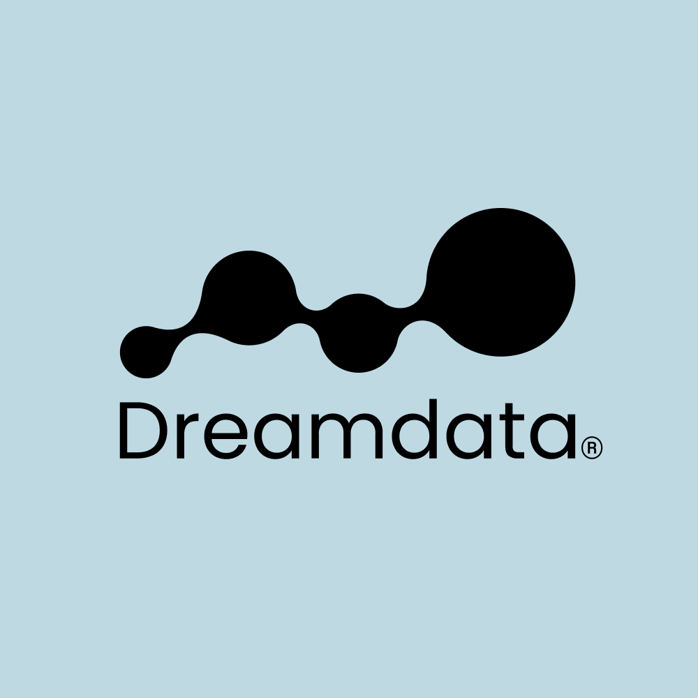

<p align="center">
  
</p>

<h1 align="center">Dreamdata MCP Server</h1>

<p align="center">
  Connect your AI assistant to your Dreamdata B2B go-to-market data — saved reports,
  account journeys, audiences, and the report builder.
</p>

<p align="center">
  <a href="https://cursor.com/install-mcp?name=dreamdata&config=eyJ1cmwiOiJodHRwczovL21jcC5kcmVhbWRhdGEuaW8vbWNwIn0%3D"></a>
</p>

<p align="center">
  <a href="https://developer.dreamdata.io/mcp/mcp-server"><strong>Documentation</strong></a>
  &nbsp;·&nbsp;
  <a href="mailto:mcp-feedback@dreamdata.io"><strong>Feedback &amp; support</strong></a>
</p>

---

## What this is

Dreamdata runs a **hosted, remote MCP server** at `https://mcp.dreamdata.io/mcp`. There is
nothing to install, build, or self-host — you point your MCP client at that URL and sign in
with your existing Dreamdata account.

This repository is the public home for the connector: the plugin manifest, the client
configuration, and the logo. Full product documentation lives at
<https://developer.dreamdata.io/mcp/mcp-server>. The server implementation itself is
closed-source.

| | |
|---|---|
| **Endpoint** | `https://mcp.dreamdata.io/mcp` |
| **Transport** | Streamable HTTP |
| **Auth** | OAuth 2.1 with PKCE and Dynamic Client Registration — no API keys, no secrets to paste |
| **Hosting** | Hosted by Dreamdata in the EU (Google Cloud `europe-west1`) |
| **Requires** | A Dreamdata account with report access |
| **Docs** | <https://developer.dreamdata.io/mcp/mcp-server> |

## Install

### Cursor

Click the button above, or add it by hand to `~/.cursor/mcp.json` (global) or
`.cursor/mcp.json` (per-project):

```json
{
  "mcpServers": {
    "dreamdata": {
      "url": "https://mcp.dreamdata.io/mcp"
    }
  }
}
```

Cursor will open a browser window for you to sign in to Dreamdata the first time the server
is used. Once the tools show up under **Settings → MCP**, you are connected.

### Claude Code

```bash
claude mcp add --transport http dreamdata https://mcp.dreamdata.io/mcp
```

### Claude (desktop and web)

Add a **custom connector** under **Settings → Connectors** with the URL
`https://mcp.dreamdata.io/mcp`.

### Any other MCP client

Point it at `https://mcp.dreamdata.io/mcp` over streamable HTTP and let it run the OAuth
flow. The client must support OAuth 2.1 with Dynamic Client Registration
([RFC 7591](https://www.rfc-editor.org/rfc/rfc7591)); there is no static client ID or API key
to configure.

## Choosing an account

One endpoint serves every Dreamdata account you belong to. Every account-scoped tool takes
an optional `slug` argument:

- If you belong to exactly one account, it is selected automatically.
- If you belong to several, ask the assistant to call `list_my_accounts` and then name the
  one you want ("use the acme account"). It will pass the right `slug` from then on.

Access is checked against Dreamdata on every call, so you can only ever read the accounts
you are already a member of.

## Tools

Full descriptions, arguments, and worked examples are in the
[developer docs](https://developer.dreamdata.io/mcp/mcp-server). You do not call these by
name — describe what you want and the assistant picks the right tool.

**Reports**

| Tool | What it does |
|---|---|
| `list_saved_reports` | Catalog of the saved reports you can see |
| `run_saved_report` | Run a saved report and return its results |
| `run_saved_report_for_date_range` | Run a saved report over a custom absolute date range |
| `list_report_metric_drilldown_entities` | List the entities behind a single metric value |

**Companies and journeys**

| Tool | What it does |
|---|---|
| `search_companies` | Find companies by name |
| `get_company_journey` | Full journey detail for a company — summary and sessions |
| `list_company_journey_stages` | Pipeline stages a company has reached |

**Audiences**

| Tool | What it does |
|---|---|
| `list_audiences` | Saved audiences in the account |
| `get_audience_definition` | Load a saved audience definition and its config |
| `run_audience_query` | Run audience criteria and return matching companies or contacts |
| `describe_audience_config_schema` | JSON schema for an audience condition group |
| `list_audience_filter_properties` | The account's audience filter property catalog |
| `list_audience_filter_values` | Distinct values for a filter property |

**Report builder** — build a report from scratch, step by step

| Tool | What it does |
|---|---|
| `report_builder_start` | Begin a new report configuration |
| `report_builder_list_analysis_types` | Available analysis types |
| `report_builder_list_subjects` | Subjects available for an analysis type |
| `report_builder_get_components` | Metrics, dimensions, and filters for a subject |
| `report_builder_resolve_calendar_period` | Resolve a calendar period to absolute dates |
| `report_builder_resolve_rolling_window` | Resolve a rolling window to absolute dates |
| `report_builder_list_property_values` | Values for a filter property |
| `report_builder_search_property_values` | Search values for a filter property |
| `report_builder_run_config` | Run a configuration and return results |
| `report_builder_save_report` | Save a configuration as a report in Dreamdata |

**Accounts**

| Tool | What it does |
|---|---|
| `list_my_accounts` | Dreamdata accounts you belong to, with their slugs |

## Things to ask

- "Which channels drove the most pipeline last quarter?"
- "Show me the full journey for Acme Corp and which touchpoints led to the opportunity."
- "Build a report of new closed-won revenue by source for FY2026 and save it."
- "Which companies in my target-accounts audience visited pricing in the last 30 days?"

## Security and privacy

- **No credentials in config.** Authentication is OAuth 2.1 with PKCE; your MCP client
  registers itself dynamically and holds a short-lived token. Nothing sensitive is written
  into `mcp.json`.
- **Read-scoped by default.** Tools read your Dreamdata data. The one exception is
  `report_builder_save_report`, which saves a report in your account and requires the
  `reports:write` scope.
- **Per-request authorization.** Every tool call re-checks that your token grants access to
  the requested account.
- Dreamdata's security posture and subprocessors: <https://trust.dreamdata.io>
- Vulnerability reports: [mcp-feedback@dreamdata.io](mailto:mcp-feedback@dreamdata.io) — see [SECURITY.md](SECURITY.md)

## Troubleshooting

**The sign-in window opens but nothing connects.** Check that your MCP client supports OAuth
Dynamic Client Registration. Clients that require a pre-issued client ID cannot connect.

**"You are a member of more than one account."** Ask the assistant to call
`list_my_accounts` and tell it which account to use.

**Tools are missing or a call is rejected.** Tool availability follows your Dreamdata
permissions. If a report or audience is not visible to you in the Dreamdata Platform, it is
not visible over MCP either.

**`410 Gone`.** You are on a retired per-account endpoint
(`https://mcp.dreamdata.io/accounts/{slug}/mcp`). Reconnect using
`https://mcp.dreamdata.io/mcp` and pass the account with the `slug` argument instead.

More setup and troubleshooting detail lives in the developer docs:
<https://developer.dreamdata.io/mcp/mcp-server>

## Repository layout

```
.cursor-plugin/plugin.json   Cursor plugin manifest (name, logo, MCP config pointer)
mcp.json                     MCP client configuration for the hosted server
server.json                  MCP registry metadata (modelcontextprotocol.io schema)
assets/logo.png              Dreamdata mark
```

## Support

- **Documentation:** <https://developer.dreamdata.io/mcp/mcp-server>
- **Questions, bugs, and feedback:** [mcp-feedback@dreamdata.io](mailto:mcp-feedback@dreamdata.io)

Please email issues rather than filing them on GitHub — the mailbox is monitored by the team
that runs the server, so it reaches the right people faster.

## About Dreamdata

Dreamdata is a B2B go-to-market data platform that joins your marketing, sales, and product
data into complete account journeys and revenue attribution. <https://dreamdata.io>

Dreamdata ApS · Kalvebod Brygge 39, 1560 Copenhagen, Denmark
Dreamdata Inc · 535 8th Avenue, 12th Floor, New York, NY 10018, United States

## License

The contents of this repository are released under the [MIT License](LICENSE). "Dreamdata"
and the Dreamdata logo are trademarks of Dreamdata ApS; the MIT License covers this
repository's configuration and documentation, not the trademarks. Use of the hosted
`mcp.dreamdata.io` service is governed by your Dreamdata agreement.
